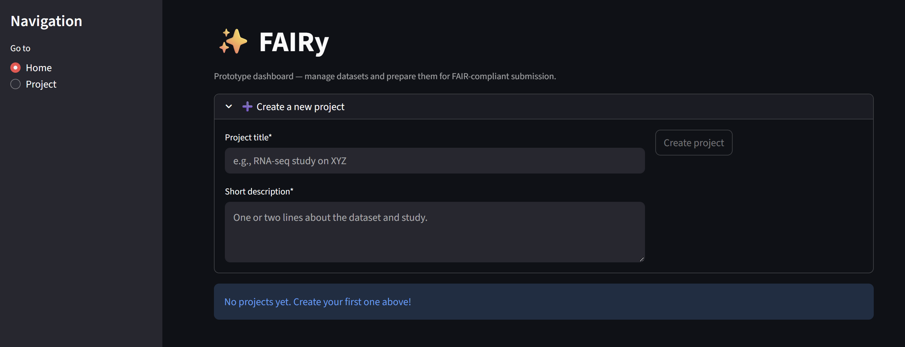

# ✨ FAIRy Skeleton

🚧 **Prototype / Smoketest** 🚧  
This is an experimental [Streamlit](https://streamlit.io/) prototype for FAIRy —  
a local-first validator and packager for FAIR-compliant data submissions.  

- ✅ Shows basic flows: create project, upload CSV, validate, export placeholder  
- ⚠️ Not production-ready — meant for demos, testing, and early feedback  
- 🔓 The clean, open-source FAIRy Core engine (validator, templates, CLI) will live in a separate repo soon

---

## 📸 Screenshot

### Dashboard view


---

## 🚀 Getting Started

Clone the repo and set up a virtual environment:

```bash
git clone https://github.com/yuummmer/metadata-wizard.git
cd metadata-wizard   # or fairy-skeleton if you renamed it
python -m venv .venv
source .venv/bin/activate
pip install -r requirements.txt
streamlit run app.py
